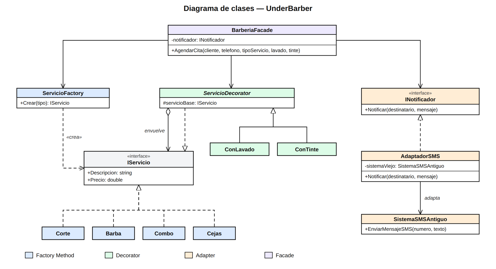

# Especificación SDD — UnderBarber

## 1. Problema

Una barbería necesita agendar citas: el cliente elige un servicio base (corte, barba, combo o cejas), puede añadir extras (lavado, tinte) y recibe un SMS de confirmación. Sin patrones, el código tendría que decidir con `if/else` qué servicio crear, crear una clase por cada combinación de extras, depender directamente de un sistema SMS antiguo con otra interfaz y repetir todo el proceso en cada lugar donde se agende una cita.

## 2. Requisitos

- **RF-01:** El sistema debe crear el servicio base según el tipo (`"corte"`, `"barba"`, `"combo"`, `"cejas"`) sin que el cliente use `new` sobre clases concretas.
- **RF-02:** Precios base: Corte 20000, Barba 15000, Combo 30000, Cejas 10000.
- **RF-03:** El sistema debe permitir añadir lavado (+5000) y/o tinte (+25000) a cualquier servicio. La descripción lista cada extra y el precio es el base más los extras.
- **RF-04:** El sistema debe notificar al cliente por SMS mediante la interfaz `INotificador`, sin depender directamente del sistema SMS antiguo.
- **RF-05:** El sistema debe ofrecer un único método `AgendarCita(cliente, telefono, tipoServicio, lavado, tinte)` que cree el servicio, aplique extras, muestre el resumen y notifique.
- **RF-06:** Si el tipo no existe, el sistema debe lanzar `ArgumentException` con el mensaje `"Servicio no existe"`.

## 3. Patrón seleccionado

- **Factory Method (creacional):** `ServicioFactory`. Crea el servicio correcto según el tipo (RF-01, RF-02, RF-06).
- **Decorator (estructural):** `ConLavado`, `ConTinte`. Añade extras sin crear una clase por combinación (RF-03).
- **Adapter (estructural):** `AdaptadorSMS`. Adapta `SistemaSMSAntiguo` a `INotificador` sin modificarlo (RF-04).
- **Facade (estructural):** `BarberiaFacade`. Ofrece un solo punto de entrada, `AgendarCita()` (RF-05).

## 4. Diseño propuesto

**Flujo de `AgendarCita`:**

1. La fachada pide el servicio a `ServicioFactory.Crear(tipo)`.
2. Si hay lavado y/o tinte, lo envuelve con `ConLavado` / `ConTinte` (en ese orden).
3. Muestra descripción y precio total.
4. Envía el SMS con `INotificador` (implementado por `AdaptadorSMS`).

## 5. Criterios de aceptación

- **CA-01:** Se agenda `"corte"` sin extras → `"Corte de cabello"`, precio 20000.
- **CA-02:** Se agenda `"barba"` sin extras → `"Arreglo de barba"`, precio 15000.
- **CA-03:** Se agenda `"combo"` sin extras → `"Corte + Barba"`, precio 30000.
- **CA-04:** Se agenda `"cejas"` sin extras → `"Diseño de cejas"`, precio 10000.
- **CA-05:** `"corte"` con lavado → `"Corte de cabello + Lavado"`, precio 25000.
- **CA-06:** `"combo"` con tinte → `"Corte + Barba + Tinte"`, precio 55000.
- **CA-07:** `"corte"` con lavado y tinte → `"Corte de cabello + Lavado + Tinte"`, precio 50000.
- **CA-08:** Se agenda una cita con teléfono `3001234567` → se envía el SMS con `INotificador` y se imprime `[SMS antiguo] Enviando a 3001234567: ...`.
- **CA-09:** Se llama una sola vez a `AgendarCita` → se muestra el resumen y se envía el SMS, sin que el cliente use fábrica, decoradores ni notificador.
- **CA-10:** Se pide el tipo `"tatuaje"`, `"ceja"` o `"CEJAS"` → se lanza `ArgumentException("Servicio no existe")`.
