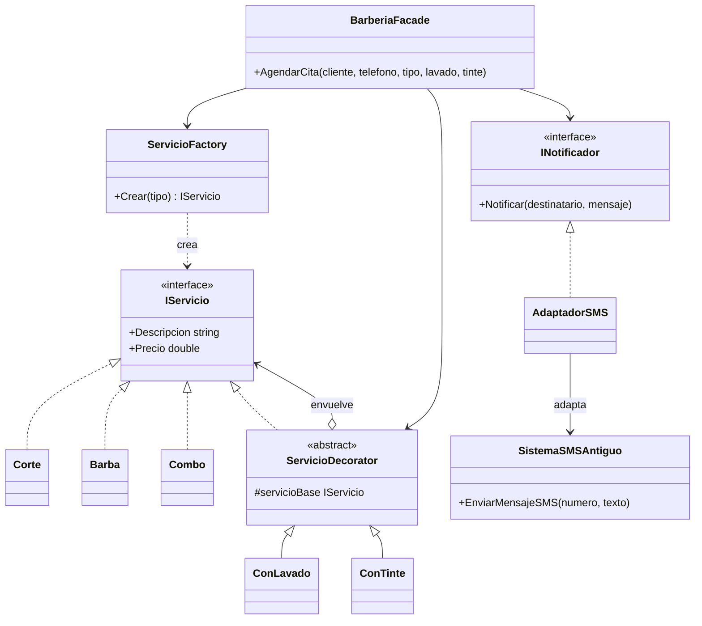

# Diseño técnico: Agendar cita

## 6. Patrones seleccionados y justificación

| Patrón | Problema encontrado | Por qué ayuda | Ventaja frente a crear/usar directamente |
|---|---|---|---|
| **Factory Method** (creacional) | Elegir y construir Corte/Barba/Combo según un texto | Centraliza la creación en `ServicioFactory` y devuelve `IServicio` | El cliente no conoce las clases concretas; agregar un servicio se cambia en un solo lugar |
| **Decorator** (estructural) | Extras combinables (lavado, tinte) | Cada extra envuelve un `IServicio` y suma descripción y precio | Evita 2^n clases por combinación; se apilan en tiempo de ejecución |
| **Adapter** (estructural) | `SistemaSMSAntiguo.EnviarMensajeSMS` no coincide con `INotificador.Notificar` | `AdaptadorSMS` traduce una interfaz a la otra | No se toca el sistema legado y se puede cambiar de proveedor |
| **Facade** (estructural) | El cliente tendría que coordinar fábrica, decoradores y notificador | `BarberiaFacade.AgendarCita()` oculta el proceso | Un solo punto de entrada, menos acoplamiento |

## 7. Diseño propuesto

### Flujo de `AgendarCita`
1. La fachada pide el servicio base a `ServicioFactory.Crear(tipo)`.
2. Si hay lavado y/o tinte, envuelve el servicio con `ConLavado` / `ConTinte`.
3. Muestra descripción y precio total.
4. Envía la confirmación con `INotificador` (implementado por `AdaptadorSMS`).
