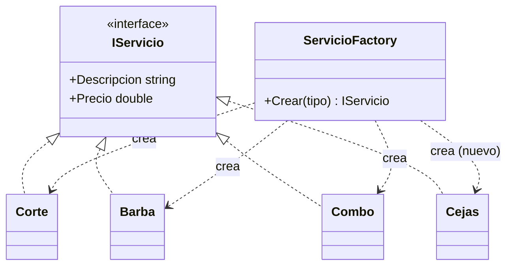

# Diseño técnico: Agregar el servicio Cejas

## Contexto

Estado actual verificado en el código (ver `proposal.md` para el porqué):

- `ServicioFactory.Crear(string tipo)` es un `switch` de expresiones que mapea
  `"corte"`, `"barba"` y `"combo"` a sus clases, y lanza
  `ArgumentException("Servicio no existe")` en el caso por defecto.
- Los tres servicios existentes son clases concretas que implementan `IServicio`
  con `Descripcion` y `Precio` como propiedades de solo lectura y cuerpo de
  expresión (una línea cada una), sin constructor ni estado.
- `BarberiaFacade.AgendarCita` ya consume `IServicio` y aplica
  `ConLavado` / `ConTinte` de forma genérica; no contiene ninguna lista de
  servicios ni condiciones por tipo.
- No existe proyecto de pruebas en la solución: la verificación es la salida de
  `dotnet run` comparada contra los criterios de aceptación de la spec.

Restricciones: C# 8 / .NET 8, aplicación de consola, ejemplo didáctico. El
código usa comentarios en español y los archivos están organizados en carpetas
por patrón de diseño.

## Goals / Non-Goals

**Goals:**

- Agregar `cejas` como cuarto servicio base reutilizando el punto de extensión
  ya existente, sin introducir un mecanismo nuevo de registro.
- Cero cambios de comportamiento en los servicios y tipos ya implementados.
- Mantener el costo de la extensión en el orden de "una clase más una rama".

**Non-Goals:**

- No se rediseña `ServicioFactory` (p. ej. a reflection, diccionario o
  auto-registro). Ese rediseño es un cambio conceptual mayor y no lo pide el
  enunciado.
- No se normaliza la entrada (`"Cejas"`, `" CEJAS "`, `"ceja"`): el
  comportamiento actual de `ArgumentException` se documenta como tal.
- No se agregan servicios de cejas al `Combo` ni nuevos extras o decoradores.
- No se introduce un framework de pruebas; la validación es la salida de consola.

## Decisiones

### D-1. `Cejas` como clase concreta que implementa `IServicio`

Se agrega `src/UnderBarber/Servicios/Cejas.cs` con la misma forma que `Corte`,
`Barba` y `Combo`: sin estado, propiedades de solo lectura con cuerpo de
expresión, `Descripcion => "Diseño de cejas"` y `Precio => 10000`.

**Alternativas consideradas:**

- *Poner el precio y la descripción en la fábrica y devolver un servicio
  genérico parametrizado.* Se descartó porque colapsa el Factory Method: los
  datos del producto pasarían a vivir en la fábrica y la fábrica decidiría el
  precio, que es exactamente la responsabilidad del producto. También rompería
  la simetría con los tres servicios existentes.
- *Heredar de `ServicioDecorator`.* No aplica: un decorador envuelve otro
  servicio y suma precio; `cejas` es un producto base, no un extra.

### D-2. Una rama más en el `switch` de `ServicioFactory.Crear`

Se agrega `"cejas" => new Cejas(),` junto a las otras tres ramas.

**Alternativas consideradas:**

- *Convertir el `switch` en un diccionario de factories `Func<IServicio>`.*
  Se descartó: es el mismo resultado con más indirección, y el `switch` es lo
  más legible y didáctico para el objetivo del ejercicio. El costo del
  `switch` es irrelevante a esta escala y el orden de Iteración es determinista
  (el caso por defecto no se alcanza nunca para claves registradas, incluso si
  las claves se duplicaran).
- *Reordenar las ramas por precio.* No aporta nada funcional; se conserva el
  orden existente (corte, barba, combo) y `cejas` se agrega al final para que
  el diff de las otras ramas sea nulo.

### D-3. Sin cambios en la fachada, los decoradores ni el adaptador

`BarberiaFacade` resuelve el tipo a `IServicio` y todo lo que sigue opera sobre
esa interfaz. Por eso no hay ni un `if` que agregar ni condición que mantener.
Esto es intencional: el valor de la demostración está en que el cliente no
conoce la clase concreta, y "tocar la fachada para sumar un servicio"
contradiría la tesis del ejercicio.

### D-4. Extensión del alcance de la spec, no del código

`Combo` sigue siendo "Corte + Barba" a 30000. La spec nueva cubre lo que el
cambio agrega; el comportamiento de los servicios existentes se documenta solo
como criterio de no regresión (CA-9).

### D-5. Verificación por salida de consola, sin proyecto de pruebas

Se valida siguiendo la convención ya establecida en `agendar-cita`: un caso más
en `Program.cs` cuyo resultado se contrasta con la tabla de criterios de
aceptación. Agregar un proyecto de pruebas de integración para cuatro clases sin
lógica excedería el alcance de un ejercicio de clase.

## Riesgos / Trade-offs

- **[El `switch` de la fábrica crece con cada servicio nuevo]** → Es el costo
  conocido y aceptado del Factory Method simple, y para un catálogo de servicios
  de barbería el orden de magnitud (decenas de tipos) no lo justifica. Si
  llegara amolestarse, el punto de migración natural es un registro por tipo,
  pero ese patrón no se enseña aquí.
- **[La comparación de `tipo` es sensible a mayúsculas y no recorta espacios]**
  → Se documenta explícitamente en RF-01 (escenario "Variante no registrada") y
  en CA-8, de modo que el comportamiento sea intencional y no parezca un
  defecto. Normalizar la entrada es un cambio de comportamiento de un requisito
  existente y por eso queda fuera de este cambio.
- **[`openspec/specs/citas/spec.md` no existe todavía; la especificación base
  sigue en el cambio pendiente `agendar-cita`]** → `openspec validate` reporta
  que el archivado rechazaría las secciones MODIFIED mientras la base no exista.
  Mitigación: archivar o sincronizar `agendar-cita` antes de aplicar y archivar
  este cambio, para que RF-01 y RF-02 tengan una base real sobre la que aplicar
  el delta. Está anotado en `proposal.md`.
- **[El texto de la descripción es salida visible en consola y en el SMS]**
  → Si se prefiere otra redacción ("Arreglo de cejas"), es un cambio de una
  línea en `Cejas.Descripcion` y en los escenarios de la spec; no afecta la
  estructura ni el resto del diseño.

## Plan de migración

No aplica migración de datos ni despliegue: es una adición a una aplicación de
consola sin persistencia. El rollback consiste en borrar `Cejas.cs`, quitar la
rama del `switch`, quitar la línea de demostración en `Program.cs` y revertir
el README. No hay estado que restaurar.
